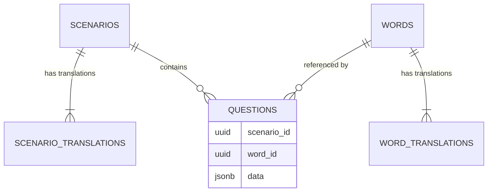

# 🗄️ Dokumentacja Bazy Danych PalabraBox (Supabase)

Dokument opisuje strukturę i zasady działania bazy danych dla projektu PalabraBox po refaktoryzacji (marzec 2026). Struktura jest w pełni zoptymalizowana pod wiele języków, AI oraz minimalizację powielania danych.

---

## Production verification — 2026-10-10 (E0)

Verified against full dumps of the production database taken before the migration baseline (reference snapshots in `supabase/archive/`):

- `prod_schema_20261008.sql` — full schema dump
- `backup_data_20261008.sql` — data-only dump, kept as the **pre-wipe content backup**

### Schema: migrations + known drift

Production matches what the historical migrations produce, plus drift left over from keeping the live app working:

| Drift                                                                                                                   | Detail                                                                                                                                                                      |
| :---------------------------------------------------------------------------------------------------------------------- | :-------------------------------------------------------------------------------------------------------------------------------------------------------------------------- |
| `questions.correct_answer`, `questions.wrong_answers`, `questions.image_emoji`                                          | legacy columns re-added outside migrations (87 old-seed rows still use them)                                                                                                |
| `words.word`, `words.language`, `words.translation_es`, `words.translation_en`, `words.image_emoji`, `words.audio_text` | same — 96 old-seed words live only in these columns                                                                                                                         |
| `words.base_key` nullable                                                                                               | migrations declare `NOT NULL`                                                                                                                                               |
| constraint names                                                                                                        | `scenarios_new_pkey`, `words_new_pkey`, `scenarios_new_level_check`, `words_new_level_check`, `words_new_base_key_key` leak the table rename inside the 2026-03-27 refactor |

Removal plan: the vestige columns are dropped **only after E7 is deployed** (the live app still reads them) by a dedicated `drop_legacy_columns` migration, which also restores `NOT NULL` on `words.base_key`. Constraint renames happen in E3.

### Content inventory

| Table                   | Rows | Notes                                                                                                                                                                                                                                                                                        |
| :---------------------- | :--- | :------------------------------------------------------------------------------------------------------------------------------------------------------------------------------------------------------------------------------------------------------------------------------------------- |
| `scenarios`             | 36   | 30 from content blocks + 6 old-seed scenarios (colors/animals/food/family/body/travel), duplicated, without translations                                                                                                                                                                     |
| `scenario_translations` | 60   | 30 `en` + 30 `es` (block scenarios only)                                                                                                                                                                                                                                                     |
| `words`                 | 359  | 263 block words (`base_key`) + 96 old-seed words (vestige columns only, `base_key IS NULL`)                                                                                                                                                                                                  |
| `word_translations`     | 479  | 263 `en` + 216 `es`                                                                                                                                                                                                                                                                          |
| `questions`             | 783  | 360 with `question_text = 'undefined'` (generator bug, AUDIT §2.3.3); mixed direction (`source_language`: 366 `en` / 330 `es` / 87 NULL); 139 choice-type questions without usable `options` (85 `image_match` with empty `data`, 38 `listening`, 16 `multiple_choice`); old seed duplicated |

### Decision (owner, 2026-10-08)

Production content is not worth migrating. The E5 content migration wipes all content tables and loads normalized content (es→en) generated from `scripts/content_blocks/`. `backup_data_20261008.sql` is the pre-wipe backup.

---

## Migration workflow (E2)

The 10 historical migrations (2026-03-18 … 2026-03-30) are squashed into a single baseline: `supabase/migrations/20260318000000_baseline.sql`. The version deliberately keeps the earliest historical timestamp so the production migration history already records it.

**Local:** `npx supabase db reset` rebuilds the schema from the baseline alone; content arrives via the content migration (E5), and `seed.sql` stays a documented no-op (E8).

**Production (one-time, owner action):** first read the `migrations` section of `scripts/db/verify.sql` (SQL Editor) to confirm which versions are recorded, then:

```bash
# 1. mark the superseded migrations as reverted
#    (the baseline keeps version 20260318000000 — only revert if it is missing)
npx supabase migration repair --status reverted 20260324000000 20260327100000 20260327110000 20260327120000 20260327130000 20260327140000 20260327150000 20260327160000 20260330173417
npx supabase migration repair --status applied 20260318000000

# 2. verify: push must be a no-op
npx supabase db push
```

After the repair, `npx supabase db pull` should report **only the known drift** (vestige columns, `base_key` nullability, constraint names) — if it reports anything else, stop and investigate. The generated diff file is expected; review it and delete it, do not commit (only `supabase/migrations/` is applied by the CLI).

---

## 🏗️ Architektura Ogólna

Baza danych opiera się na znormalizowanej strukturze pięciu głównych tabel w schemacie `public`:

1. **`scenarios` & `scenario_translations`**: Scenariusze z uniwersalnymi danymi oraz tłumaczeniami (tytuły, opisy).
2. **`words` & `word_translations`**: Słowa kluczowe (fiszki) rozdzielone na klucz główny i tłumaczenia dla poszczególnych języków.
3. **`questions`**: Pytania i zadania w elastycznym formacie opartym na kolumnie `JSONB`, umożliwiającym różne warianty zadań.

### Diagram ERD (Uproszczony)



---

## 📊 Tabele

### 1. `scenarios`

Główna tabela scenariuszy (niezależna od języka).

| Kolumna      | Typ       | Opis                                             |
| :----------- | :-------- | :----------------------------------------------- |
| `id`         | `uuid`    | Klucz główny (PK), domyślnie `gen_random_uuid()` |
| `category`   | `text`    | Kategoria tematyczna (np. 'travel', 'food')      |
| `level`      | `text`    | Poziom trudności: `beginner` \| `intermediate`   |
| `sort_order` | `integer` | Kolejność wyświetlania (rosnąco)                 |

### 1a. `scenario_translations`

Tłumaczenia interfejsu (tytułów i opisów) dla scenariuszy.

| Kolumna       | Typ    | Opis                                                    |
| :------------ | :----- | :------------------------------------------------------ |
| `id`          | `uuid` | Klucz główny (PK)                                       |
| `scenario_id` | `uuid` | Klucz obcy (FK) do `scenarios.id` na usuwanie kaskadowe |
| `language`    | `text` | Język tłumaczenia (np. `en`, `es`, `pl`)                |
| `title`       | `text` | Przetłumaczony tytuł (np. "Lotnisko")                   |
| `description` | `text` | Przetłumaczony opis                                     |

_Unikalny indeks na: `(scenario_id, language)`_

### 2. `words`

Główny rejestr słówek.

| Kolumna    | Typ    | Opis                                      |
| :--------- | :----- | :---------------------------------------- |
| `id`       | `uuid` | Klucz główny (PK)                         |
| `base_key` | `text` | Unikalny klucz/słowo bazowe (np. 'apple') |
| `category` | `text` | Kategoria / Tematyka                      |
| `level`    | `text` | Poziom językowy                           |

### 2a. `word_translations`

Tłumaczenia danego słowa na konkretne języki.

| Kolumna      | Typ    | Opis                                                |
| :----------- | :----- | :-------------------------------------------------- |
| `id`         | `uuid` | Klucz główny (PK)                                   |
| `word_id`    | `uuid` | Klucz obcy (FK) do `words.id` na usuwanie kaskadowe |
| `language`   | `text` | Kod języka (np. `en`, `es`)                         |
| `text`       | `text` | Przetłumaczone słowo                                |
| `audio_text` | `text` | Fragment przeznaczony dla Text-To-Speech            |

_Unikalny indeks na: `(word_id, language)`_

### 3. `questions`

Przechowuje zadania wewnątrz scenariuszy. Dzięki formatowi `JSONB` jest niezwykle elastyczna.

| Kolumna             | Typ       | Opis                                                   |
| :------------------ | :-------- | :----------------------------------------------------- |
| `id`                | `uuid`    | Klucz główny (PK)                                      |
| `scenario_id`       | `uuid`    | FK do `scenarios.id` (Wymagane)                        |
| `word_id`           | `uuid`    | Opcjonalny FK do centralnego rejestru `words.id`       |
| `type`              | `text`    | Typ zadania (np. `multiple_choice`, `image_match`)     |
| `question_text`     | `text`    | Treść pytania bazowa (Wymagane)                        |
| `question_text_tts` | `text`    | Tekst dla syntezatora mowy (TTS)                       |
| `hint`              | `text`    | Opcjonalna podpowiedź w UI gry                         |
| `sort_order`        | `integer` | Kolejność zadań w danym podejściu                      |
| `data`              | `jsonb`   | Zmienna, dynamiczna treść specyficzna dla typu pytania |
| `source_language`   | `text`    | Język bazowy pytania (np. `en`)                        |
| `target_language`   | `text`    | Język którego dotyczy pytanie (np. `es`)               |

#### Pola zależne (kolumna `data JSONB`)

Dawniej twarde kolumny. Obecnie obiekt zależny od `type`. Przykłady co tam może siedzieć:

- Dla typu **`multiple_choice`**: `{"correct": "rojo", "options": ["rojo", "blanco", "verde", "azul"]}`
- Dla typu **`image_match`**: `{"correct": "coche", "image_emoji": "🚗", "options": ["coche", "bicicleta", "avión"]}`

---

## 🏷️ Typy Wyliczeniowe (Enums / Logic)

### Poziomy (`level`)

- `beginner`: Podstawy, predefiniowane dla nowych.
- `intermediate`: Średniozaawansowany.

### Języki (`language` / `source_language` / `target_language`)

- Bazowo używamy dwuliterowych kodów np. `en`, `es`, choć legacy korzysta także z pełnych nazw wg potrzeby UI.

### Typy Pytań (`type`)

1. `multiple_choice`: Wybór ABCD.
2. `image_match`: Dopasowanie tekstu do ikony.
3. `listening`: Słuchanko -> odpowiedź.
4. `fill_blank`: Puste miejsca w zdaniu.
5. `word_order`: Kolejność układania z puzzli.

---

## 🔒 Bezpieczeństwo (RLS)

- **Public Read (SELECT)**: Dostęp odczytu jest włączony publicznie (MVP nie wymaga logowania po stronie gracza).
- Politiki RLS:
  - `Allow public read - scenarios`
  - `Allow public read - scenario_translations`
  - `Allow public read - words`
  - `Allow public read - word_translations`
  - `Allow public read - questions`

---

## 🚀 Wskazówki Dla Programistów i Skryptów AI

- **Generowanie UUID**: Nadal używaj `gen_random_uuid()` po stronie Supabase lub deterministycznych identyfikatorów z zewnątrz przez skrypty w Pythonie, jeżeli zachodzi wymóg sztywnej relacji i seedu.
- **Wstawianie Seedów (`seed.sql`)**: Ze względu na relacyjne klucze `word_id` do tłumaczeń bierzemy metodę _UPSERT_: `ON CONFLICT (base_key) DO NOTHING` a tabele tłumaczeń połączyć na `ON CONFLICT (word_id, language) DO NOTHING`.
- **Typowanie Questions.data**: Po stronie frontendu należy utworzyć odpowiednie modele T-S dla obiektów przypisanych wewnątrz klucza `data` dla każdego rodzaju `question.type`.
