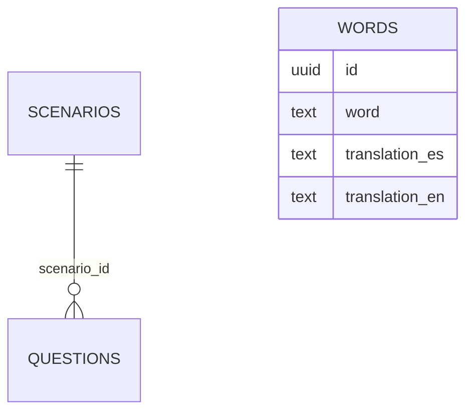

# 🗄️ Dokumentacja Bazy Danych PalabraBox (Supabase)

Dokument opisuje strukturę i zasady działania bazy danych dla projektu PalabraBox. Służy jako przewodnik dla programistów i asystentów AI przy dodawaniu nowych treści, modyfikacji schematu oraz optymalizacji zapytań.

---

## 🏗️ Architektura Ogólna

Baza danych opiera się na trzech głównych tabelach w schemacie `public`:

1. **`scenarios`**: Zbiory tematyczne (np. "Lotnisko", "Zwierzaki").
2. **`questions`**: Konkretne zadania przypisane do scenariuszy (wiele typów pytań).
3. **`words`**: Bank słówek używany głównie w trybie Flashcards (Fiszki).

### Diagram ERD (Uproszczony)



---

## 📊 Tabele

### 1. `scenarios`

Przechowuje grupy lekcji/modułów.

| Kolumna | Typ | Opis |
| :--- | :--- | :--- |
| `id` | `uuid` | Klucz główny (PK), domyślnie `gen_random_uuid()` |
| `title` | `text` | Wewnętrzny tytuł techniczny |
| `title_display` | `text` | Tytuł wyświetlany w UI (np. "Los Animales") |
| `language` | `text` | Język nauczany: `english` \| `spanish` |
| `level` | `text` | Poziom trudności: `beginner` \| `intermediate` |
| `category` | `text` | Kategoria tematyczna (do filtrowania) |
| `emoji` | `text` | Ikona emoji reprezentująca scenariusz |
| `description` | `text` | Krótki opis modułu (opcjonalny) |
| `sort_order` | `integer` | Kolejność wyświetlania (rosnąco) |

### 2. `questions`

Przechowuje zadania wewnątrz scenariuszy. Relacja Many-to-One ze `scenarios`.

| Kolumna | Typ | Opis |
| :--- | :--- | :--- |
| `id` | `uuid` | Klucz główny (PK) |
| `scenario_id` | `uuid` | Klucz obcy (FK) do `scenarios.id` |
| `type` | `text` | Typ zadania (zobacz [Typy Pytań](#typy-pytań)) |
| `question_text` | `text` | Treść pytania |
| `question_text_tts` | `text` | (Opcjonalnie) Tekst do przeczytania przez lektora |
| `correct_answer` | `text` | Poprawna odpowiedź |
| `wrong_answers` | `text[]` | Tablica błędnych odpowiedzi (używana w MCQ) |
| `image_emoji` | `text` | Emoji pomocnicze dla pytań obrazkowych |
| `hint` | `text` | Podpowiedź wyświetlana graczowi |
| `sort_order` | `integer` | Kolejność w sesji gry |

### 3. `words`

Bank słownictwa (słownik). Niepowiązany bezpośrednio ze scenariuszami (możliwość dynamicznego doboru).

| Kolumna | Typ | Opis |
| :--- | :--- | :--- |
| `id` | `uuid` | Klucz główny (PK) |
| `word` | `text` | Słowo w języku źródłowym (`language`) |
| `translation_es` | `text` | Tłumaczenie na hiszpański |
| `translation_en` | `text` | Tłumaczenie na angielski |
| `category` | `text` | Kategoria słówka |
| `audio_text` | `text` | Tekst dla syntezatora mowy (TTS) |

---

## 🏷️ Typy Wyliczeniowe (Enums / Logic)

### Poziomy (`level`)

- `beginner`: Podstawowe zwroty, pojedyncze słowa.
- `intermediate`: Pełne zdania, gramatyka.

### Języki (`language`)

Aplikacja wspiera obecnie naukę:

- `english`
- `spanish`

### Typy Pytań

W aplikacji zdefiniowano następujące formaty (`type`):

1. `multiple_choice`: Klasyczne ABCD.
2. `image_match`: Dopasowanie słowa do Emoji.
3. `listening`: Słuchanie lektora i wybór zapisanego słowa.
4. `fill_blank`: Uzupełnianie brakującego słowa w zdaniu.
5. `word_order`: Przeciągnij i upuść (DND) słowa w poprawnej kolejności.

---

## 🔒 Bezpieczeństwo (RLS)

- **Public Read (SELECT)**: Każdy może odczytywać dane (wymagane dla klienta MVP bez logowania).
- **Service Role Write**: Tylko administrator (lub skrypty backendowe) mogą modyfikować tabelę.
- **Politiki**:
  - `Allow public read - scenarios`
  - `Allow public read - questions`
  - `Allow public read - words`

---

## 🚀 Jak dodawać dane?

### 1. Przez Seeding (`supabase/seed.sql`)

Najlepszy sposób na masowe dodawanie treści. Używamy poleceń `INSERT INTO ... ON CONFLICT (id) DO NOTHING`.

> [!TIP]
> Przy dodawaniu nowych `questions`, upewnij się, że `scenario_id` odpowiada istniejącemu rekordowi w tabeli `scenarios`.

### 2. Przez Migracje

Jeśli zmieniasz strukturę (np. dodajesz kolumnę), stwórz nową migrację w `supabase/migrations/YYYYMMDD_opispodwyzki.sql`.

### 3. Przykład: Dodanie nowego słowa

```sql
INSERT INTO public.words (word, language, level, category, translation_es, translation_en, image_emoji, audio_text)
VALUES ('computer', 'english', 'beginner', 'technology', 'ordenador', NULL, '💻', 'computer');
```

---

## 🛠️ Wskazówki dla Asystentów

- **Generowanie UUID**: Używaj `gen_random_uuid()` w Postgresie lub generuj stabilne UUID poza bazą, jeśli chcesz uniknąć duplikatów w seedach.
- **Typy TypeScript**: Synchronizuj zmiany z plikiem `src/types/index.ts`.
- **Relacje**: Przy dodawaniu pytań dbaj o to, by `scenario_id` było poprawne – inaczej pytanie nigdy nie pojawi się w grze.
- **Weryfikacja**: Po dodaniu danych sprawdź ich wyświetlanie w aplikacji lub za pomocą `supabase-mcp-server_list_tables`.
