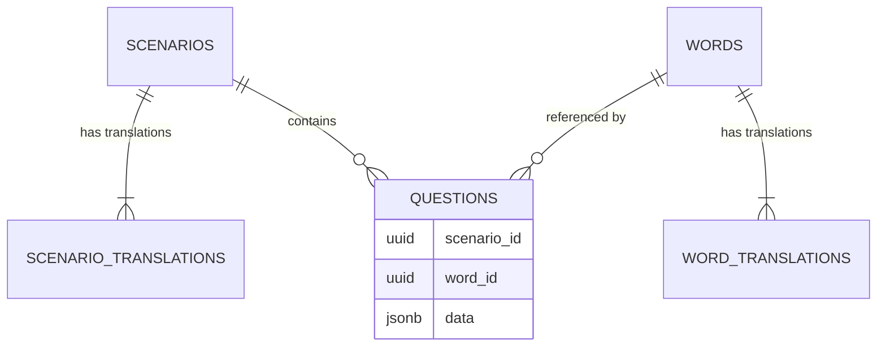

# 🗄️ Dokumentacja Bazy Danych PalabraBox (Supabase)

Dokument opisuje strukturę i zasady działania bazy danych dla projektu PalabraBox po refaktoryzacji (marzec 2026). Struktura jest w pełni zoptymalizowana pod wiele języków, AI oraz minimalizację powielania danych.

---

## 🏗️ Architektura Ogólna

Baza danych opiera się na znormalizowanej strukturze pięciu głównych tabel w schemacie `public`:

1. **`scenarios` & `scenario_translations`**: Scenariusze z uniwersalnymi danymi oraz tłumaczeniami (tytuły, opisy).
2. **`words` & `word_translations`**: Słowa kluczowe (fiszki) rozdzielone na klucz główny i tłumaczenia dla poszczególnych języków.
3. **`questions`**: Pytania i zadania w elastycznym formacie opartym na kolumnie `JSONB`, umożliwiającym różne warianty zadań.

### Diagram ERD (Uproszczony)

---

## 📊 Tabele

### 1. `scenarios`

Główna tabela scenariuszy (niezależna od języka).

| Kolumna      | Typ       | Opis                                             |
| :----------- | :-------- | :----------------------------------------------- |
| `id`         | `uuid`    | Klucz główny (PK), domyślnie `gen_random_uuid()` |
| `category`   | `text`    | Kategoria tematyczna (np. 'travel', 'food')      |
| `level`      | `text`    | Poziom trudności: `beginner` \| `intermediate`   |
| `sort_order` | `integer` | Kolejność wyświetlania (rosnąco)                 |

### 1a. `scenario_translations`

Tłumaczenia interfejsu (tytułów i opisów) dla scenariuszy.

| Kolumna       | Typ    | Opis                                                    |
| :------------ | :----- | :------------------------------------------------------ |
| `id`          | `uuid` | Klucz główny (PK)                                       |
| `scenario_id` | `uuid` | Klucz obcy (FK) do `scenarios.id` na usuwanie kaskadowe |
| `language`    | `text` | Język tłumaczenia (np. `en`, `es`, `pl`)                |
| `title`       | `text` | Przetłumaczony tytuł (np. "Lotnisko")                   |
| `description` | `text` | Przetłumaczony opis                                     |

_Unikalny indeks na: `(scenario_id, language)`_

### 2. `words`

Główny rejestr słówek.

| Kolumna    | Typ    | Opis                                      |
| :--------- | :----- | :---------------------------------------- |
| `id`       | `uuid` | Klucz główny (PK)                         |
| `base_key` | `text` | Unikalny klucz/słowo bazowe (np. 'apple') |
| `category` | `text` | Kategoria / Tematyka                      |
| `level`    | `text` | Poziom językowy                           |

### 2a. `word_translations`

Tłumaczenia danego słowa na konkretne języki.

| Kolumna      | Typ    | Opis                                                |
| :----------- | :----- | :-------------------------------------------------- |
| `id`         | `uuid` | Klucz główny (PK)                                   |
| `word_id`    | `uuid` | Klucz obcy (FK) do `words.id` na usuwanie kaskadowe |
| `language`   | `text` | Kod języka (np. `en`, `es`)                         |
| `text`       | `text` | Przetłumaczone słowo                                |
| `audio_text` | `text` | Fragment przeznaczony dla Text-To-Speech            |

_Unikalny indeks na: `(word_id, language)`_

### 3. `questions`

Przechowuje zadania wewnątrz scenariuszy. Dzięki formatowi `JSONB` jest niezwykle elastyczna.

| Kolumna             | Typ       | Opis                                                   |
| :------------------ | :-------- | :----------------------------------------------------- |
| `id`                | `uuid`    | Klucz główny (PK)                                      |
| `scenario_id`       | `uuid`    | FK do `scenarios.id` (Wymagane)                        |
| `word_id`           | `uuid`    | Opcjonalny FK do centralnego rejestru `words.id`       |
| `type`              | `text`    | Typ zadania (np. `multiple_choice`, `image_match`)     |
| `question_text`     | `text`    | Treść pytania bazowa (Wymagane)                        |
| `question_text_tts` | `text`    | Tekst dla syntezatora mowy (TTS)                       |
| `hint`              | `text`    | Opcjonalna podpowiedź w UI gry                         |
| `sort_order`        | `integer` | Kolejność zadań w danym podejściu                      |
| `data`              | `jsonb`   | Zmienna, dynamiczna treść specyficzna dla typu pytania |
| `source_language`   | `text`    | Język bazowy pytania (np. `en`)                        |
| `target_language`   | `text`    | Język którego dotyczy pytanie (np. `es`)               |

#### Pola zależne (kolumna `data JSONB`)

Dawniej twarde kolumny. Obecnie obiekt zależny od `type`. Przykłady co tam może siedzieć:

- Dla typu **`multiple_choice`**: `{"correct": "rojo", "options": ["rojo", "blanco", "verde", "azul"]}`
- Dla typu **`image_match`**: `{"correct": "coche", "image_emoji": "🚗", "options": ["coche", "bicicleta", "avión"]}`

---

## 🏷️ Typy Wyliczeniowe (Enums / Logic)

### Poziomy (`level`)

- `beginner`: Podstawy, predefiniowane dla nowych.
- `intermediate`: Średniozaawansowany.

### Języki (`language` / `source_language` / `target_language`)

- Bazowo używamy dwuliterowych kodów np. `en`, `es`, choć legacy korzysta także z pełnych nazw wg potrzeby UI.

### Typy Pytań (`type`)

1. `multiple_choice`: Wybór ABCD.
2. `image_match`: Dopasowanie tekstu do ikony.
3. `listening`: Słuchanko -> odpowiedź.
4. `fill_blank`: Puste miejsca w zdaniu.
5. `word_order`: Kolejność układania z puzzli.

---

## 🔒 Bezpieczeństwo (RLS)

- **Public Read (SELECT)**: Dostęp odczytu jest włączony publicznie (MVP nie wymaga logowania po stronie gracza).
- Politiki RLS:
  - `Allow public read - scenarios`
  - `Allow public read - scenario_translations`
  - `Allow public read - words`
  - `Allow public read - word_translations`
  - `Allow public read - questions`

---

## 🚀 Wskazówki Dla Programistów i Skryptów AI

- **Generowanie UUID**: Nadal używaj `gen_random_uuid()` po stronie Supabase lub deterministycznych identyfikatorów z zewnątrz przez skrypty w Pythonie, jeżeli zachodzi wymóg sztywnej relacji i seedu.
- **Wstawianie Seedów (`seed.sql`)**: Ze względu na relacyjne klucze `word_id` do tłumaczeń bierzemy metodę _UPSERT_: `ON CONFLICT (base_key) DO NOTHING` a tabele tłumaczeń połączyć na `ON CONFLICT (word_id, language) DO NOTHING`.
- **Typowanie Questions.data**: Po stronie frontendu należy utworzyć odpowiednie modele T-S dla obiektów przypisanych wewnątrz klucza `data` dla każdego rodzaju `question.type`.
